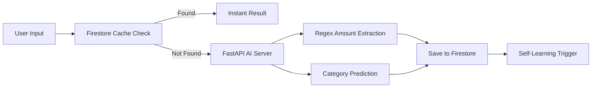

# 🚀 Smart Expense AI - Intelligent Expense Tracker

---

## ✨ Overview

**Smart Expense AI** is a next-generation personal finance tracker built with **Flutter** and powered by a custom **Machine Learning model**.

Instead of filling forms manually, users can simply type:

> *"bus ticket 150.50"*

The AI will:

* 💰 Extract the **exact amount (with decimals)**
* 🧠 Predict the **correct category instantly**

All wrapped in a sleek **Glassmorphism UI**, dark theme, and a **self-learning system** that improves over time.

---

## 🎯 Key Features

* 🧠 **Natural Language Processing (NLP)**
  Enter expenses in plain text — AI handles the rest.

* 🔄 **Continuous Self-Learning**
  Corrections automatically retrain the model.

* ⚡ **Personalized AI Cache**
  Firestore remembers your habits for faster predictions.

* 🔐 **Google Authentication**
  Secure one-tap login with Firebase Auth.

* 📊 **Advanced Analytics**
  Beautiful charts with `fl_chart`.

* 🎨 **Premium UI/UX**
  Glassmorphism + Dark Mode + Poppins + Haptic Feedback.

---

## 🛠️ Tech Stack

### 📱 Frontend (Mobile App)

* **Framework:** Flutter (Dart)
* **UI Design:** Glassmorphism + Dark Theme (`#020617`)
* **Database:** Firebase Cloud Firestore
* **Authentication:** Firebase Auth (Google Sign-In)
* **UX Enhancements:** Google Fonts (Poppins), Haptic Feedback

### ⚙️ Backend (AI Server)

* **Framework:** FastAPI (Python)
* **Hosting:** Hugging Face Spaces (`venu17/smart-expense-ai`)
* **ML Tools:** Scikit-learn, Pandas, Joblib
* **Model:** `SGDClassifier` + `TfidfVectorizer`
* **CI/CD:** Auto dataset updates & retraining via API

---

## 🏗️ System Architecture



---

## 🚀 Installation & Setup

### 📱 1. Flutter Setup

```bash
# Clone the repository
git clone https://github.com/vthish/smart-expense-ai.git

# Navigate to project
cd smart-expense-ai

# Install dependencies
flutter pub get

# Run the app
flutter run
```

---

## ⚙️ Backend Setup (Local Server)

You can run the FastAPI backend locally using either a **standard Python setup** or **Docker (recommended)**.

---

### 🅰️ Method 1: Python Environment Setup

```bash
# Navigate to backend
cd backend

# Create virtual environment
python -m venv venv

# Activate environment
# Windows:
venv\Scripts\activate

# macOS/Linux:
source venv/bin/activate

# Install dependencies
pip install -r requirements.txt

# Run server
uvicorn main:app --reload --host 0.0.0.0 --port 8000
```

📌 Backend URL:
http://localhost:8000

---

### 🐳 Method 2: Docker Setup (Recommended)

#### 🔹 Build & Run

```bash
docker build -t smart-expense-ai-backend .
docker run -p 8000:8000 --env HF_TOKEN=your_token_here smart-expense-ai-backend
```

#### 🔹 Docker Compose

```bash
docker-compose up --build
```

---

## 🔗 Connect Flutter to Backend

Update API base URL in:

```
lib/services/ai_service.dart
```

Use:

* Android Emulator → http://10.0.2.2:8000
* iOS/Web → http://127.0.0.1:8000

---

## 🧠 AI Logic

* Regex for amount extraction:

```regex
\d+[.,]?\d*
```

* NLP Pipeline:

  * Text Vectorization → `TfidfVectorizer`
  * Classification → `SGDClassifier`

* Self-learning loop via `/learn` endpoint

---

## 📊 UI Preview (Optional)

> *(You can add screenshots here later for extra impact)*

---

## 🌟 Future Improvements

* 📈 Budget forecasting
* 🔔 Smart spending alerts
* 🌍 Multi-currency support
* 📱 iOS optimization
* 🤖 Deep learning upgrade

---

## 👨‍💻 Developer

**Venusha Thishan (vthish)**
🎓 Software Engineering Student - NIBM
💻 Full Stack Developer & IoT Innovator
🌍 Sri Lanka 🇱🇰

---

## ⭐ Support

If you like this project:

👉 Give it a **star ⭐ on GitHub**
👉 Share with others
👉 Contribute ideas or improvements

---

<p align="center">
  <b>🔥 Built with passion + AI 🔥</b>
</p>
